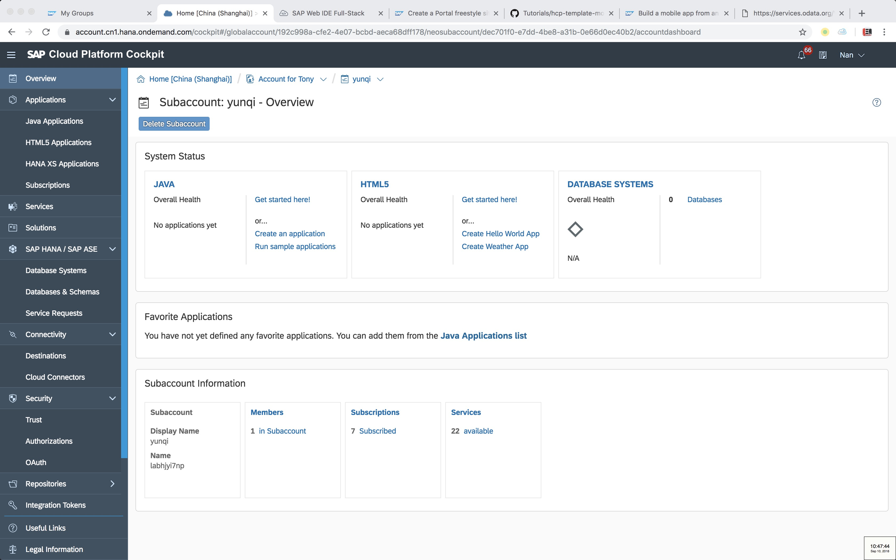
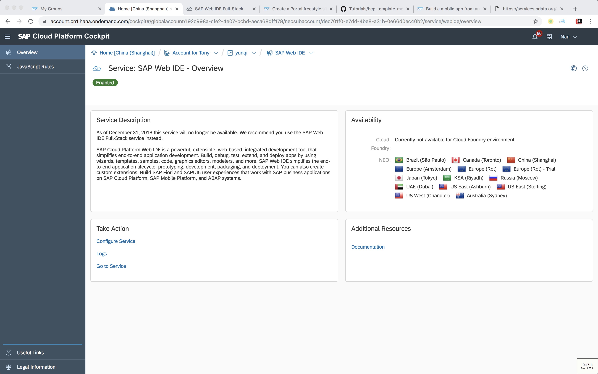
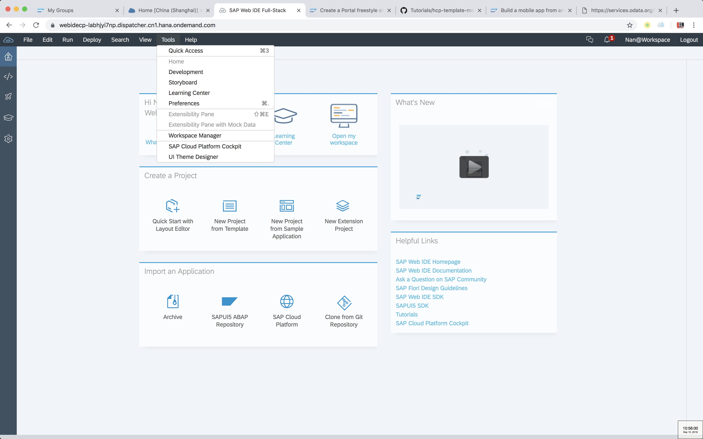
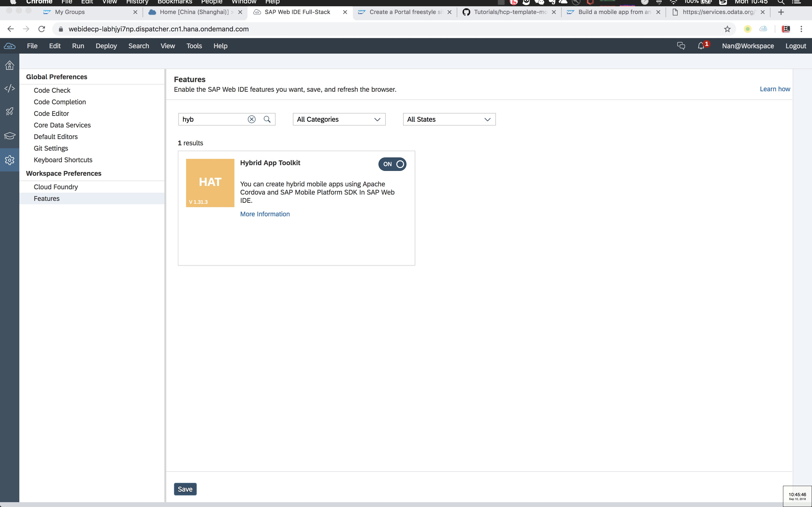
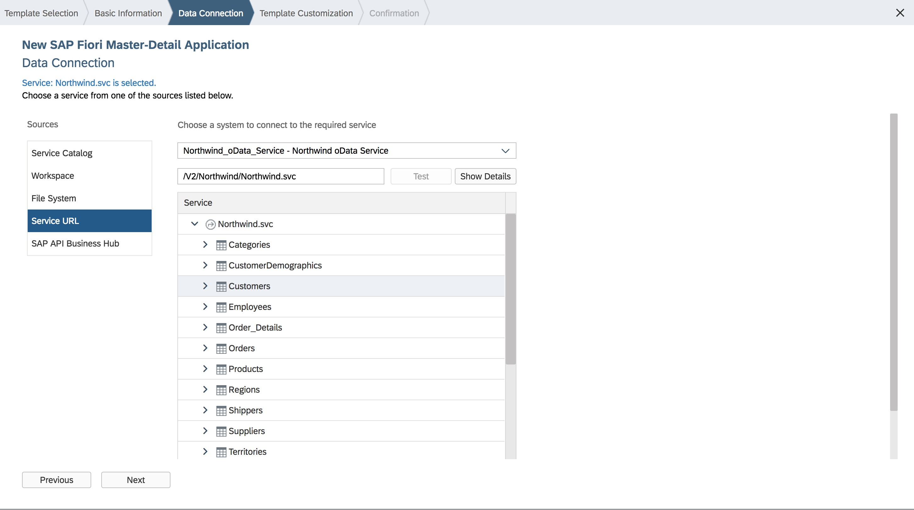
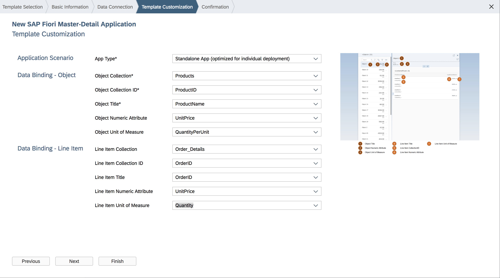

## Prerequisites
- **Proficiency:** Beginner
- **Tutorials:** [Create a Destination on SAP Cloud Platform](https://www.sap.com/developer/tutorials/hcp-create-destination.html)

## Next Steps
- [Deploy an app to SAP Cloud Platform](https://www.sap.com/developer/tutorials/hcp-deploy-mobile-web-app.html)

## Details

### You will learn
The SAP Web IDE (Integrated Development Environment) has a project template wizard, which makes it easy to create new applications quickly. In this tutorial you will build a mobile app that reads product and supplier information from an OData source and displays it in a responsive mobile web app.

You will be setting a few configurations, then filling out a few forms in this step, but the end result is an application which can be run on a mobile device.  Ready?  Let's get started...

### Time to Complete
**10 min**


[ACCORDION-BEGIN [Step 1: ](Log into SAP Cloud Platform)]

1. Log in to your SAP Cloud Platform cockpit ([link](https://account.cn1.hana.ondemand.com/cockpit#/globalaccount/192c998a-cfe2-4e07-bcbd-aeca68dff178/neosubaccount/dec701f0-e7dd-4be8-a31b-0e66d0ec40b2/accountdashboard) and please find your login information on the table.




[ACCORDION-END]

[ACCORDION-BEGIN [Step 2: ](Open SAP Web IDE)]

To open SAP Web IDE, click on the **Services** tab in the navigation bar, scroll down and then click the **SAP Web IDE** tile to open the SAP Web IDE service page.


On the service page, click on the **Go to service** link to open Web IDE in a new browser tab.




[ACCORDION-END]

[ACCORDION-BEGIN [Step 3: ](Enable Hybrid App Toolkit plugin)]

The first configuration step is to enable the Hybrid App Toolkit plugin (this is required for Web IDE to show the hybrid template you will use later). In the Web IDE tab, click on the **Tools** menu, then **Preferences**.




In the Preferences page, click on **Features** on the left, scroll down to find the **Hybrid App Toolkit** plugin then enable it by clicking on the slider.




[ACCORDION-END]

[ACCORDION-BEGIN [Step 4: ](Save the change)]

6. Click **Save**, and you will see a dialog box explaining that Web IDE will refresh. The purpose of the refresh is that after selecting the Hybrid App Toolkit plugin, Web IDE will download with the hybrid app configured templates you will use in this tutorial.


[ACCORDION-END]

[ACCORDION-BEGIN [Step 5: ](Open new project wizard)]

Once SAP Web IDE reloads, close the **Tips and Tricks** dialog box, then click on **File > New > Project from Template** to open the new project creation wizard.


[ACCORDION-END]

[ACCORDION-BEGIN [Step 6: ](Choose the template)]

On the **Template Selection** page, click on the **Category** pulldown menu (where you see **Featured**) and select **SAP Fiori Application**. When the mobile templates are displayed, select the **SAP Fiori Master-Detail Application** template, then click **Next**.


[ACCORDION-END]

[ACCORDION-BEGIN [Step 7: ](Name the project)]

On the **Basic Information** page of the New Project wizard enter the project name `northwind-xx` (**xx could be any number to create a new project**) and click **Next**. The project name will also become the name of your app when deployed.


[ACCORDION-END]

[ACCORDION-BEGIN [Step 8: ](Select data source)]

The next step is to select the data source for your app. On the **Data Connection** page, click on **Service URL** as service source.


[ACCORDION-END]

[ACCORDION-BEGIN [Step 9: ](Select Northwind OData Service)]

If you only have one **`WebIDEEnabled`** destination in SAP Cloud Platform, it will be selected automatically. If you don't see the **Northwind OData Service** selected (the destination you created in the previous tutorial), click on the pull down menu and select it.

> Note: If you don't see the the **Northwind OData Service** in the pull down menu, go back to your destination in the SAP Cloud Platform cockpit and double-check the entries from the previous tutorial. If you make changes, reload Web IDE, then restart the procedure in this tutorial.


[ACCORDION-END]

[ACCORDION-BEGIN [Step 10: ](Add OData path)]

After selecting the Northwind OData Service entry, enter the relative path (see below) to the OData service you will use in the field under the drop-down list-box (where it says "Paste URL here"). Be sure not to include any trailing space characters.

The relative path to enter is:

```
/V2/Northwind/Northwind.svc
```

The URL you entered for your destination plus the relative path you enter here points to the OData Service you will use for your app.


[ACCORDION-END]

[ACCORDION-BEGIN [Step 11: ](Test your connection)]

Click the **Test** button to test the connection. If the connection is successful, the Service and its Collections of the Northwind OData Service will appear. This demonstrates that your destination is working properly. Click **Next** to advance to the **Template Customization** page.




[ACCORDION-END]

[ACCORDION-BEGIN [Step 12: ](Specify settings)]

On the **Template Customization** page you will specify the displayed values on the **Application Settings**, **Data Binding - Object Section** (Products List), and the **Data Binding - Line Item Section** (Selected Product Details).

Fill out the **Application Settings** as noted in the table below.

Field Name                  |  Value
:---------------------------| :-------------
Type                        | `Standalone App`





[ACCORDION-END]

[ACCORDION-BEGIN [Step 13: ](Add main data values)]

Scroll down to the **Data Binding - Object Section**. Fill out the Data Binding - Object fields as shown in the table below.

Field Name          |  Value
:-------------------| :-------------
Object Collection           | `Product`
Object Collection ID         | `ProductID`
Object Title          | `ProductName`
Object Numeric Attribute   | `UnitPrice`
Object Unit of Measure     | `QuantityPerUnit`


[ACCORDION-END]

[ACCORDION-BEGIN [Step 14: ](Edit detail section)]

Scroll down to the **Data Binding - Line Item Section**. Fill out the Data Binding - Line Item fields as displayed in the table below.

Field Name              |  Value
:-----------------------| :-------------
Line Item Collection    | `Order_details`
Line Item Collection ID    | `OrderID`
Line Item Title         | `OrderID`


[ACCORDION-END]


[ACCORDION-BEGIN [Step 15: ](Click Finish)]

Click **Finish** to create the new Northwind application. When the generation finishes, click the **Northwind project folder icon** to see the project structure.


[ACCORDION-END]

[ACCORDION-BEGIN [Step 16: ](Run your app)]

To run your application, select the `index.html` file, and click the **Run** button. Your Northwind application will open in a Web IDE preview pane.


[ACCORDION-END]

[ACCORDION-BEGIN [Step 17: ](View completed app)]

Congratulations! You've developed your application that shows the products and supplier data!


[ACCORDION-END]


## Next Steps
- [Deploy an app to SAP Cloud Platform](https://www.sap.com/developer/tutorials/hcp-deploy-mobile-web-app.html)
